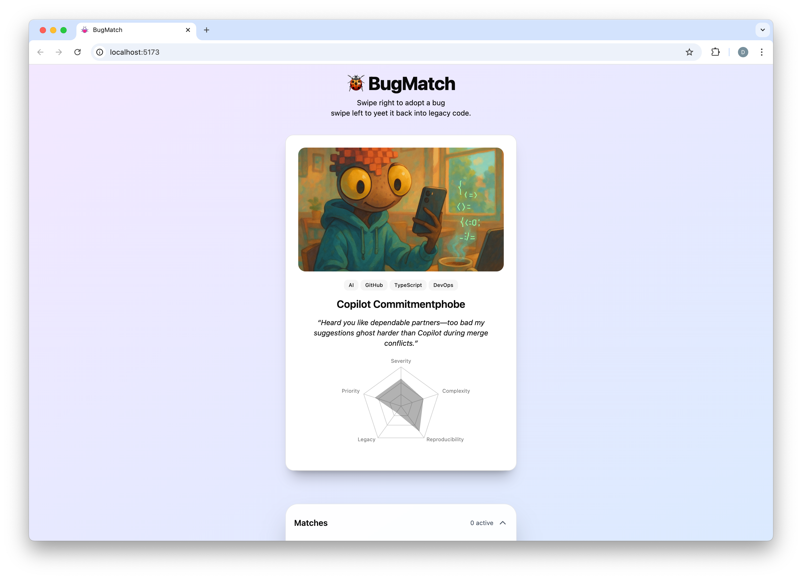

# 🐞 BugMatch

[Try BugMatch here!](https://davidyen1124.github.io/bug-match/)

## What In The Front‑End Is This?

**BugMatch** is a _totally serious_ dating‑app parody that pairs lonely software defects with developers brave enough to commit.

## Features ("value props" if Product asks)

- **Swipe‑Based Triage** — groom issues Tinder‑style because life's too short for Jira boards.
- **Cheesy Pickup Lines** — every bug comes with dialogue that should have stayed in the commit message.
- **Confetti Celebrations** — JavaScript fireworks; the only explosions that won't wake Ops.
- **Chat Sheet** — DM your chosen bug and confess your `chmod -R 777` sins in private.
- **Onboarding Quiz** — select your stack, pretend you know Kubernetes.
- **Radar Charts** — because spider‑graphs make PMs feel safe.

## Tech Stack

- **React 18** & **Vite**
- **Tailwind CSS** & **shadcn/ui**
- **framer‑motion** for fling physics
- **Recharts** for spider‑chart weirdness
- **canvas‑confetti** because dopamine

## Roadmap

- Dark mode (so you can debug at 3 AM without burning retinas)
- Pull live bugs from GitHub Issues
- Push notifications for when your bug "ghosts" you
- Electron build for people who like 200 MB desktop apps

## License

Distributed under the **BugMatch Super‑Chill Public License v0.0.1**. TL;DR: use it, abuse it, don't blame us.

### Closing Haiku

> Merge the pull request,  
> Bugs and features intertwined—  
> Git blame laughs softly.
